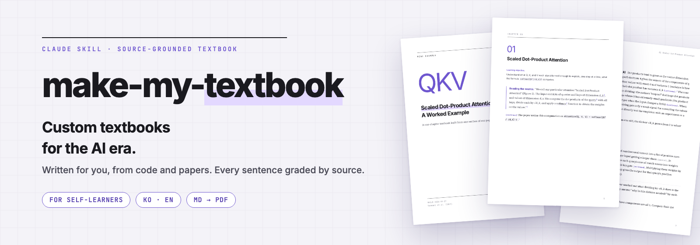
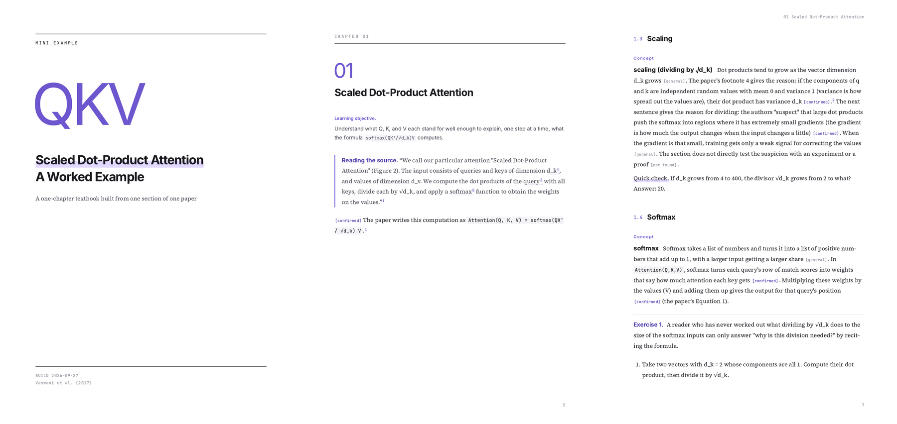
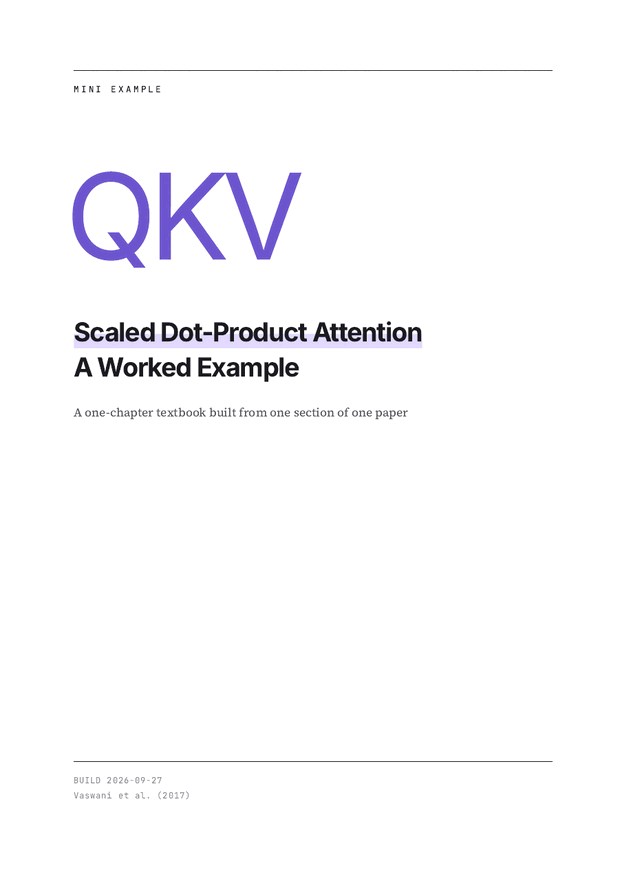
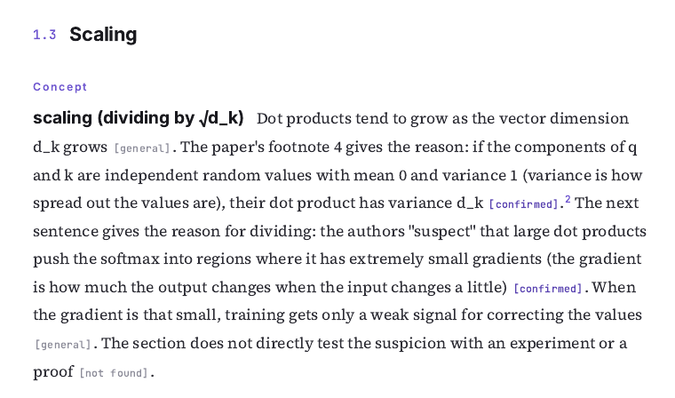
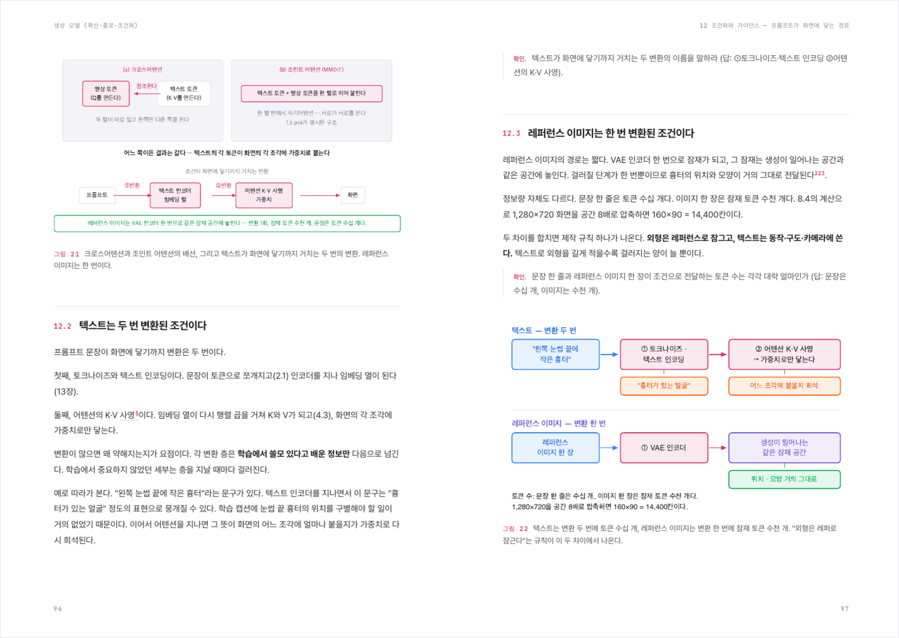
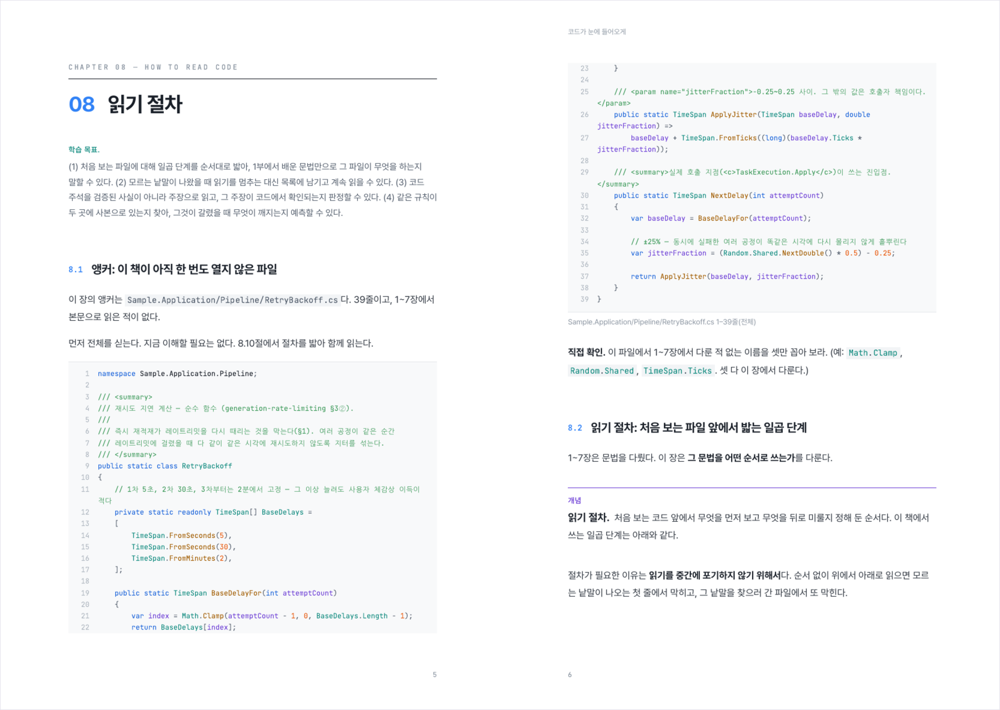

# make-my-textbook

[한국어](./README.md)

**Custom textbooks for the AI era, written for you.** Point it at code or a paper and it writes a study textbook pitched at your current level. Each sentence is marked as "in the source", "common knowledge", or "inferred", and quoted passages carry a footnote, so you can check where anything came from.

It is a Claude Code skill (an instruction file Claude follows), made by a non-developer with a visual-design background who was learning to code with AI and could not find a textbook that fit their level.

## What it produces

This is `examples/self-attention/`, built with the skill: a one-chapter textbook from one section of one paper. Open the PDF: [English](./examples/self-attention/self-attention.en.pdf) · [한국어](./examples/self-attention/self-attention.ko.pdf)

This is what the per-sentence marks look like (one paragraph at actual size).

`[general]` is common knowledge in the field, `[confirmed]` is stated in the source, `[not found]` means the claim was not found in the part that was read. The small raised number is a footnote.

## Books made with it

Pages from the two books used to refine the skill. Neither book is in this repository.

**A book made from papers and technical docs.** Pages 96-97 of a 477-page book that takes a reader from the basics of video-generation AI models to the level of the original papers (Korean).

**A book made from code.** The opening of chapter 8 of a book about reading backend code (Korean). It prints one whole code file and teaches the steps for reading it. The project name in the code was changed.

## Who it's for

People who need to understand code, papers, or official docs without a technical background: for example, a non-developer with code an AI wrote for them, or someone facing a paper they have never read. Use it when the words are readable but the meaning is not. You build the book with Claude Code, so the terminal should not be completely unfamiliar.

## How to use it

1. Put the repo in your skills folder: `git clone https://github.com/ganggangstone/make-my-textbook ~/.claude/skills/make-my-textbook`
2. In Claude Code, type `/source-grounded-textbook`. Claude never starts it by itself, so you have to type it. If the command does not show up, press `/` and look for the skill in the list.
3. Answer Claude's questions: what material to study, what you know now, how far you want to get. If you choose "start quickly", it asks only these questions and shows the defaults for the rest. Claude then writes a Markdown manuscript (a plain text file you can edit in Notepad) based on your answers.
4. Ask for a PDF when you want one. You need Node.js 22.12 or later and an internet connection. It downloads fonts, plus a browser the first time.

To use the English skill, run `cp SKILL.en.md SKILL.md` in the cloned folder. Claude Code reads only the file named `SKILL.md`.

## How it differs from just asking a chatbot

- **You can check the sources.** Each sentence is marked as: in the source, common knowledge, inferred, or not found. You can turn the marks off at the start.
- **It starts from your level.** It asks what you know and where you want to get before writing, and introduces one new concept per section. You can change that limit.
- **It re-reads and fixes the draft.** The skill lists steps that hunt for undefined terms, statements that differ from the source, and skipped steps.
- **The manuscript is a Markdown file**, so you can edit it and rebuild the PDF.

## What's here

- [`SKILL.md`](./SKILL.md): the skill (Korean, canonical). [`SKILL.en.md`](./SKILL.en.md) is the English edition.
- [`pipeline/`](./pipeline/): the tool that turns a manuscript into a PDF. You can pick an accent color.
- [`examples/self-attention/`](./examples/self-attention/): the answers to the opening questions, the manuscripts, and the PDFs.

## Languages

`SKILL.en.md` says the same things as the Korean file, rewritten as an English-style tutorial. When a rule changes, the Korean file is changed first and the English one is updated to match. Both Korean and English manuscripts build to PDF; the per-language differences are in [`pipeline/README.md`](./pipeline/README.md).

To write in another language, tell Claude to write in it. Claude also makes the PDF settings for that language by copying the English ones. Korean manuscripts get one more pass with the stop-slop-ko skill to remove AI-sounding style; if it is not installed, the skill fetches its instructions from GitHub.

Only Korean and English have been tested. Japanese, Chinese, and Arabic differ in text direction and line breaking, so they may need more CSS work.

## Built with

markdown-it (MIT), markdown-it-anchor (Unlicense), Prism (MIT), Vivliostyle CLI (AGPL-3.0). Vivliostyle CLI is installed separately and is not part of this repository. Fonts are fetched from the internet at build time (Noto Serif KR, Pretendard, Nanum Gothic Coding, Source Serif 4, Inter, JetBrains Mono; all SIL OFL) and are not stored here.

## License

MIT. See [`LICENSE`](./LICENSE).
