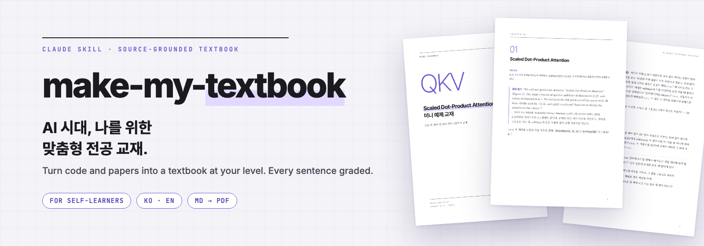
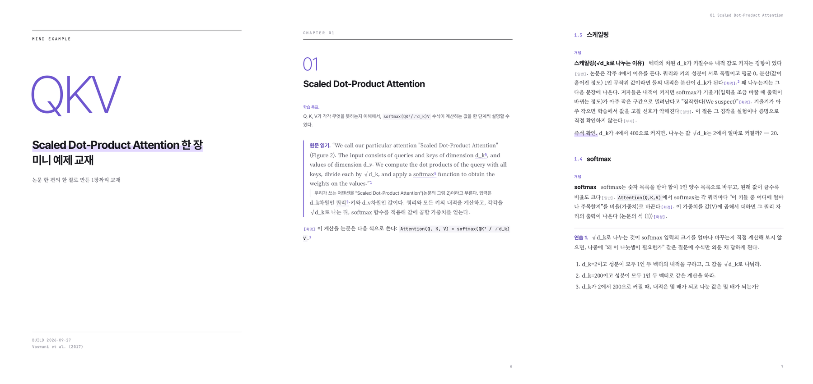
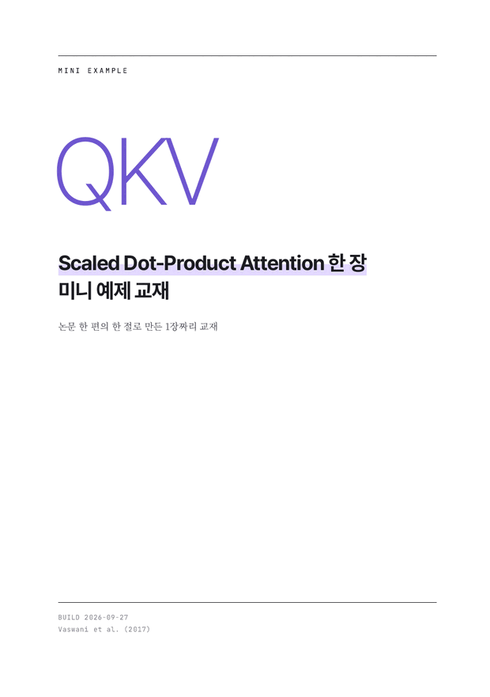
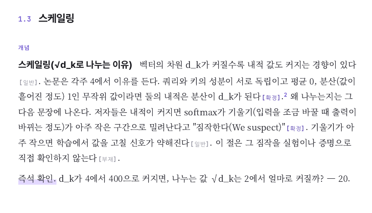

# make-my-textbook

[English](./README.en.md)

**AI 시대, 나를 위한 맞춤형 전공 교재를 만든다.** 코드나 논문을 알려주면 지금 내 수준에 맞춰 공부용 교재로 써 준다. 문장마다 "원문에 있는 말인지, 통설인지, 추론인지"를 표시하고 원문을 인용한 곳에는 각주를 달아서,할루시네이션을 방지한다.

비개발자가 AI로 학습하며 수준에 맞는 교재가 없어서 직접 만든 Claude Code용 스킬(작업 지침 파일).

## 결과물

`examples/self-attention/`을 이 스킬로 만든 교재. 논문을 교재로 만든 사례다.PDF: [한국어](./examples/self-attention/self-attention.ko.pdf) · [English](./examples/self-attention/self-attention.en.pdf)

문장마다 근거 태그, 각주 등이 붙는다.

`[일반]`은 분야의 통설, `[확정]`은 원문에 있는 말, `[부재]`는 출처 미상 이다.

## 이 스킬로 만든 책

**논문과 기술 문서로 만든 책.** 영상 생성 AI 모델을 처음부터 원문 논문 수준까지 다룬 477쪽짜리 책의 96~97쪽이다. 당시 고등학생이 박사과정수준까지 이해할 수 있게 해달라는 난도 요청을 했다.

**코드로 만든 책.** 백엔드 코드를 읽는 법을 다룬 책의 8장 앞부분이다. 코드 파일을 바탕으로, 비개발자가 파일을 읽는 순서를 가르치는 부분이다. (사내 코드라서 실제 변수명 등은 가상으로 대체했다)

## 추천 사용자

배경 없이 코드나 논문, 공식 문서를 이해해야 하는 사람. 프로그래밍 관련 내용이 아니더라도 상관 없다. 예를 들어 AI가 짜 준 코드를 이해하고 싶은 비개발자, 사전지식이 필요한 논문을 읽어야 하는 사람.

## 쓰는 법

1. 저장소를 스킬 폴더에 받는다: `git clone https://github.com/ganggangstone/make-my-textbook ~/.claude/skills/make-my-textbook`
2. Claude Code 또는 타 AI 에이전트에서 `/source-grounded-textbook`을 입력한다. AI가 먼저 시작하지 않으니 직접 입력해야 한다. 명령이 안 보이면 `/`를 눌러 목록에서 이 스킬을 찾는다.
3. AI가 묻는 질문에 답한다(무슨 자료로 공부할지, 지금 무엇을 아는지, 어디까지 이해하고 싶은지). "빠르게 시작"을 고르면 이 질문들만 묻고 나머지는 기본값을 보여 준다. 답에 맞춰 Markdown(메모장으로도 고칠 수 있는 텍스트 파일) 원고가 나온다.
4. PDF 전자책으로 만들 수 있다. Node.js 22.12 이상과 인터넷 연결이 필요하다.

영어로 쓰기 위해서는 받은 폴더에서 `cp SKILL.en.md SKILL.md`를 실행한다. 참고로 Claude Code는 `SKILL.md`라는 이름의 파일만 읽는다.

## AI챗봇에게 그냥 물어보면서 공부하면 생기는 문제

- **출처를 대조할 수 없다.** 이 도구를 사용하면 문장마다 원문에 있는 말, 통설, 추론, 자료에서 못 찾은 것을 구분해서 표시한다. 필요 시 시작할 때 이 표시를 끌 수도 있다.
- **내 수준에서 시작하지 않는다.** 이 도구는 지금 아는 것과 목표를 묻고, 새 개념은 한 절에 하나씩만 소개한다. 물론 이 한도도 바꿀 수 있다. 자신에게 맞는 방식으로 커스텀하라.
- **틀린 내용을 직접 고치지 않는다.** 이 도구는 정의 없이 쓴 낱말, 원문과 다르게 옮긴 문장, 건너뛴 단계를 찾아 고친다.
- **공부할 내용이 채팅창에 종속된다.** 이 도구는 공부할 내용ㅡㄹ PDF로 만들어, 태블릿이나 전자책 리더기 등에서 볼 수 있게 만들어준다.

## 구성

- [`SKILL.md`](./SKILL.md): 스킬 본문. 한국어판이 기준이다.
- [`pipeline/`](./pipeline/): 원고를 PDF로 만드는 도구. 포인트 색을 고를 수 있다.
- [`examples/self-attention/`](./examples/self-attention/): 시작할 때 AI가 물은 질문과 사용자 답, 원고, 결과 PDF.

## 언어

영어판 `SKILL.en.md`는 같은 내용을 영어권 자습서 방식으로 만든 버전이다. 규칙을 바꿀 땐 한국어부터 고치고 영어판을 맞춘다. 언어별 차이는 [`pipeline/README.md`](./pipeline/README.md)에 있다.

다른 언어로 쓰고 싶으면 AI에게 그 언어로 쓰라고 하면 된다. PDF도 그 언어로 나온다. 필요한 설정은 Claude가 영어 설정을 본떠 만든다. 한국어 원고는 stop-slop-ko 스킬로 AI 말투를 한 번 더 걷어낸다. 설치돼 있지 않으면 스킬이 그 지침을 GitHub에서 받아 쓴다.

시험한 언어는 한국어와 영어뿐이다. 일본어·중국어·아랍어는 글자 방향과 줄바꿈이 달라서 CSS를 더 손봐야 할 수 있다.

## 만들 때 쓴 오픈소스

markdown-it(MIT), markdown-it-anchor(Unlicense), Prism(MIT), Vivliostyle CLI(AGPL-3.0). Vivliostyle CLI는 따로 설치되고 이 저장소에는 포함되지 않는다. 폰트는 PDF를 만들 때 인터넷에서 불러오며(Noto Serif KR, Pretendard, Nanum Gothic Coding, Source Serif 4, Inter, JetBrains Mono, 모두 SIL OFL) 저장소에 들어 있지 않다.

## 라이선스

MIT. [`LICENSE`](./LICENSE) 참고.
